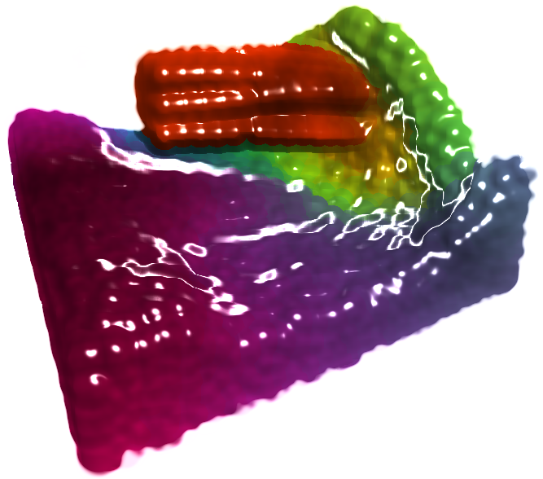
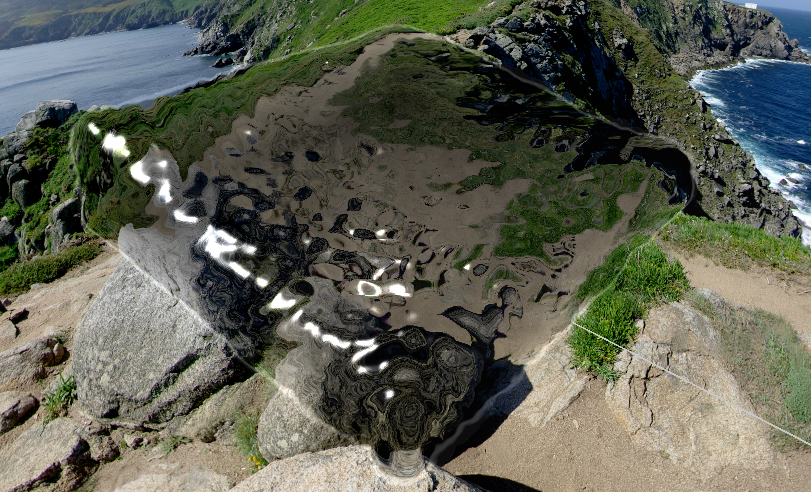
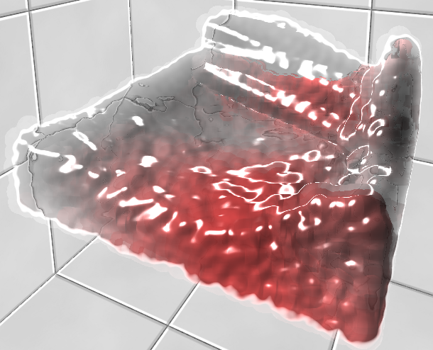
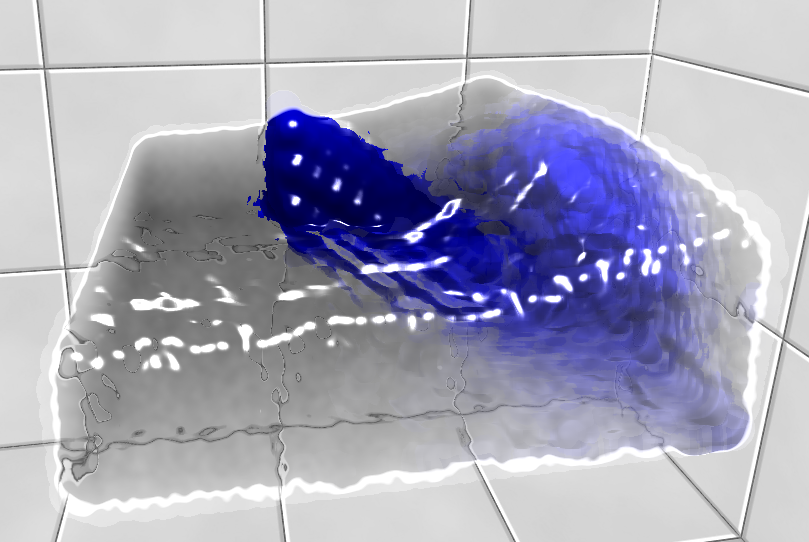
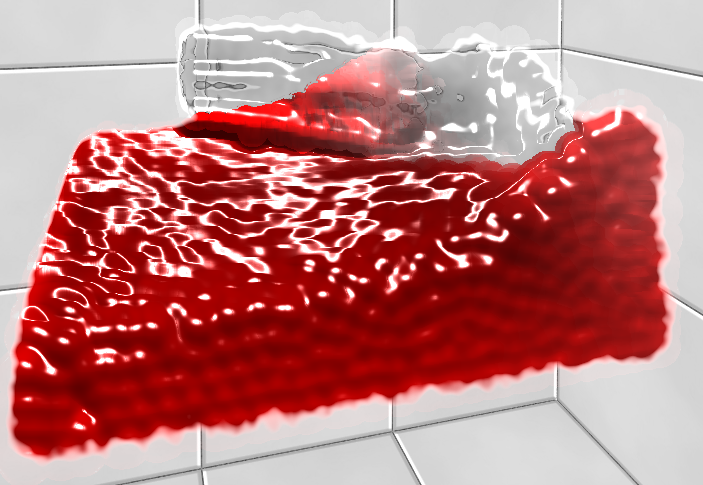

# WebGL-Fluid-Simulation
Position Based Fluid Simulation in WebGL with Multi-Color Screen Space Fluid Rendering

This prototype was developed in Firefox Nightly 45.0a1.
For best results, get it here: https://ftp.mozilla.org/pub/firefox/nightly/2015/11/2015-11-27-03-02-31-mozilla-central/

